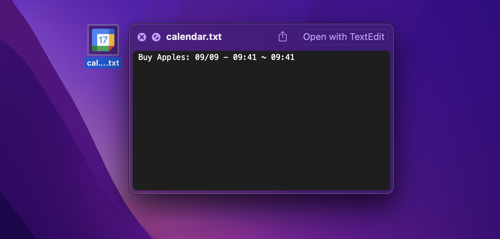

<h1 align="center">Desktop Calendar Viewer</h1>

<div align="center">
  
</div>

## ⚙️ Setup

> **Note**  
> Please make [iconic-commands](https://github.com/ogty/iconic-commands) available in advance.

```zsh
$ cd ~/ # cd
$ git clone https://github.com/ogty/desktop-schedule-viewer 
$ source ./desktop-schedule-viewer/setup.sh
```

### ☁️ Google Cloud Platform

#### 📅 Enable Google Calendar API

1. [Google Cloud Platform](https://console.cloud.google.com/)
2. Enter `Google Calendar API` in the search box
3. Select Google Calendar API and click ENABLE 

#### 🔑 Get Key

1. IAM & Admin
2. Service Accounts
3. Select the service account to use
4. Click on the tab KEYS
5. ADD KEY > Create new key > JSON > CREATE
6. Save in this directory as `credentials.json`

> **Note**  
> If you do not have a service account, click `CREATE SERVICE ACCOUNT` to create an account

#### 📎 Get Calendar ID

1. Google Calendar
2. From the left panel, under My calendars, hover your cursor near the calendar that you want to share and click on the three dots.
3. Choose the Settings and sharing option
4. Copy Calendar ID
5. Rewriting `.env` files

**`.env`**

```
CALENDAR_ID=''
PERIOD=7
FILE_NAME='calendar'
START_FORMAT='%m/%d - %H:%M'
END_FORMAT='%H:%M'
```

- `PERIOD` is the calendar period to be retrieved.
- `FILE_NAME` is the name of the file to be created on the desktop.
- `START_FORMAT` and `END_FORMAT` are formats used to represent the time of the appointment obtained from the API.

### 🤖 Update Calendar

You can update your calendar every day at 00:00 midnight by following these steps

```zsh
$ echo '0 0 * * * source ~/desktop-schedule-viewer/main' | pbcopy
$ crontab -e 
```

1. Press: <kbd>i</kbd>
2. Press: <kbd>Command</kbd> + <kbd>v</kbd>
3. Press: <kbd>Escape</kbd>
4. Enter: `:wq`

## 📝 Usage

A text file of the Google Calendar icon for that date will be generated on your desktop.  
Once clicked, you can Quick Look by pressing <kbd>Space</kbd> once.  
Now you can see your schedule.  
